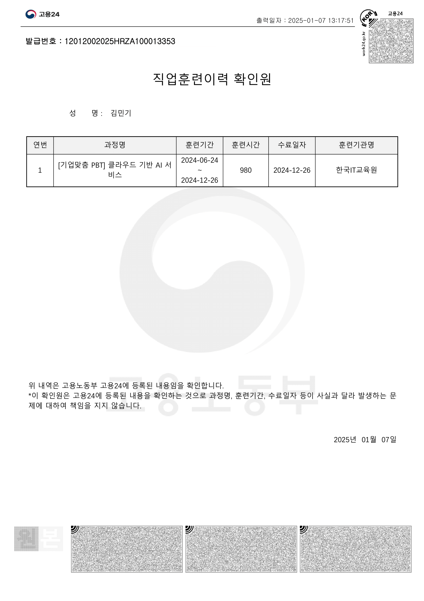

## 1. 개인 정보
이름 | 김민기 / 金旼技 / Mingi Kim
-------------|---------------------------
생년월일 | 1996년 12월 12일
이메일 | kkang45597gmail.com
기술 블로그 | https://blank001.tistory.com/
GitHub | https://github.com/kkang45597
* * *

## 2. 지원 목적
저는 입사 이전에 배우는 학습보다 실제 업무를 진행하면서 배우는 학습이 더욱 중요하다고 생각합니다. 이전 직장에서 짧은 기간밖에 근무하지 못했지만, 그 기간 동안 무엇과도 바꿀 수 없는 경험과 노하우를 얻었습니다. 이를 바탕으로 입사 후에는 실제 업무를 통해 빠르게 배우고 적용하며 성장하는 모습을 보여드리고 싶습니다.

초기에는 배우는 데 시간을 쏟겠지만, 점차 효율적인 업무 방식과 문제 해결 능력을 키워 회사의 목표와 비전에 기여할 수 있는 인재로 자리잡고자 합니다.

또한, 팀워크를 통해 더 큰 책임을 맡을 기회가 주어졌을 때 적극적으로 도전하고, 회사의 발전을 위한 중요한 역할을 할 수 있도록 최선을 다하겠습니다.
* * *

## 3. 학력
교육 기관 | 전공 / 내용 | 교육 기간
-------------|---------------------------|------------------
대구영남고등학교 |
대구한의대학교 | 의료산업융합학부 스마트IT 전공 | 2016-02 ~ 2022-02
한국 IT 교육원 | [기업맞춤 PBT] 클라우드 기반 AI 서비스 | 2024-06-24 ~ 2024-12-26
* * *

## 4. 보유 기술
<b>프로그래밍 언어</b> 
- Java, JavaScript, C, C++, Python

<b>웹 및 애플리케이션 개발</b> 
- 백엔드: Spring Boot, Django, Node.js
- 프론트엔드: React, HTML5, CSS3

<b>데이터베이스</b> 
- H2DB, MYSQL
  
<b>클라우드 및 DevOps</b> 
- AWS S3, AWS EC2, Docker, Git/GitHub

<b>기타</b> 
- RESTful API 설계, 테스트 자동화 (JUnit, Jest)
* * *

## 5. 훈련 및 자격
1. HRD-NET [기업맞춤 PBT] 클라우드 기반 AI 서비스 (2024-06-24 ~ 2024-12-26)  
[[훈련과정]](https://hrd.work24.go.kr/hrdp/co/pcobo/PCOBO0100P.do?tracseId=AIG20230000412830&tracseTme=5&crseTracseSe=C0061&trainstCstmrId=500020048147) /
[[교육 내용]](https://github.com/kkang45597/PBT_Cloud_AI_Service)

